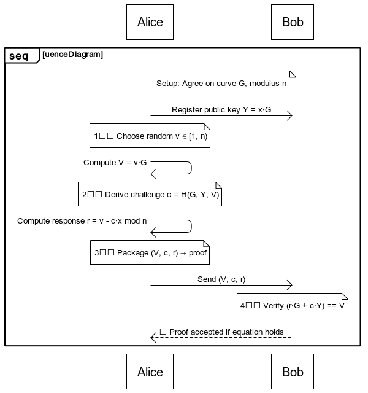
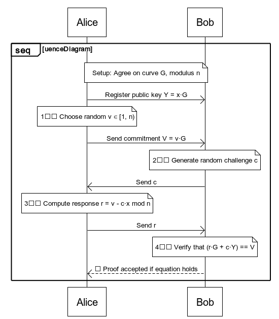
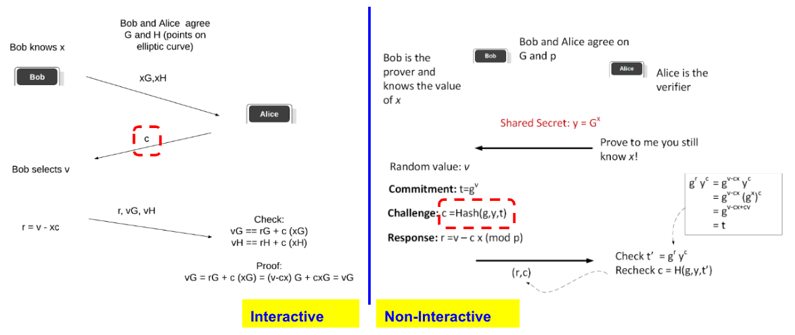

# fiat_shamir

[fiat_shamir](https://mikail-eliyah.medium.com/the-matter-of-privacy-436ffe9af4b#eced)

## Non-Interactive


```
sequenceDiagram
    participant Alice as Prover (Alice)
    participant Bob as Verifier (Bob)

    Note over Alice,Bob: Setup: Agree on curve G, modulus n

    Alice->>Bob: Register public key Y = x·G

    Note over Alice: 1️⃣ Choose random v ∈ [1, n)
    Alice->>Alice: Compute V = v·G

    Note over Alice: 2️⃣ Derive challenge c = H(G, Y, V)
    Alice->>Alice: Compute response r = v - c·x mod n

    Note over Alice: 3️⃣ Package (V, c, r) → proof
    Alice->>Bob: Send (V, c, r)

    Note over Bob: 4️⃣ Verify (r·G + c·Y) == V

    Bob-->>Alice: ✅ Proof accepted if equation holds

```    


## Interactive


```
sequenceDiagram
    participant Alice as Prover (Alice)
    participant Bob as Verifier (Bob)

    Note over Alice,Bob: Setup: Agree on curve G, modulus n

    Alice->>Bob: Register public key Y = x·G

    Note over Alice: 1️⃣ Choose random v ∈ [1, n)
    Alice->>Bob: Send commitment V = v·G

    Note over Bob: 2️⃣ Generate random challenge c
    Bob->>Alice: Send c

    Note over Alice: 3️⃣ Compute response r = v - c·x mod n
    Alice->>Bob: Send r

    Note over Bob: 4️⃣ Verify that (r·G + c·Y) == V

    Bob-->>Alice: ✅ Proof accepted if equation holds
```

---



---